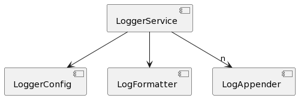

# Patterns for Custom Standalone APIs in Angular

- Actually, they are not patterns but idioms, as it is Angular-specific
- We stick with the term pattern anyway, because it's a more common term
- The patterns are primarily for reusable libs.
- The patterns are taken from the implementations of `@angular/common/http`, `@angular/router`, `@ngrx/store`, and `@ngrx/effects`.
- Golden Rule: Whenever possible, use `@Injectable({providedIn: 'root'})`

## Example

- The inferred patterns are presented using a simple logger lib
- It is as simple as possible but as complex as needed to show the patterns



```typescript
export enum LogLevel {
  DEBUG = 0,
  INFO = 1,
  ERROR = 2,
}
```

```typescript
export abstract class LoggerConfig {
  abstract level: LogLevel;
  abstract formatter: Type<LogFormatter>;
  abstract appenders: Type<LogAppender>[];
}
```

```typescript
export const defaultConfig: LoggerConfig = {
  level: LogLevel.DEBUG,
  formatter: DefaultLogFormatter,
  appenders: [DefaultLogAppender],
};
```

```typescript
export abstract class LogFormatter {
  abstract format(level: LogLevel, category: string, msg: string): string;
}
```

```typescript
export class DefaultLogFormatter implements LogFormatter {
  format(level: LogLevel, category: string, msg: string): string {
    const levelString = LogLevel[level].padEnd(5);
    return `[${levelString}] ${category.toUpperCase()} ${msg}`;
  }
}
```

```typescript
export abstract class LogAppender {
  abstract append(level: LogLevel, category: string, msg: string): void;
}
```

```typescript
export class DefaultLogAppender implements LogAppender {
  append(level: LogLevel, category: string, msg: string): void {
    console.log(msg);
  }
}
```

In out implementation, `LogAppender` implementations are provided via several multi providers. This allows other parts of the application to register additional ones. Hence, the Injector returns all of them within an array. As such an array cannot be used as a token, we use an `InjectionToken` instead:

```typescript
export const LOG_APPENDERS = new InjectionToken<LogAppender[]>("LOG_APPENDERS");
```

```typescript
@Injectable()
export class LoggerService {
  private appenders = inject(LOG_APPENDERS);
  private formatter = inject(LogFormatter);
  private config = inject(LoggerConfig);

  log(level: LogLevel, category: string, msg: string): void {
    if (level < this.config.level) {
      return;
    }
    const formatted = this.formatter.format(level, category, msg);
    for (const a of this.appenders) {
      a.append(level, category, formatted);
    }
  }

  error(category: string, msg: string): void {
    this.log(LogLevel.ERROR, category, msg);
  }

  info(category: string, msg: string): void {
    this.log(LogLevel.INFO, category, msg);
  }

  debug(category: string, msg: string): void {
    this.log(LogLevel.DEBUG, category, msg);
  }
}
```

Remark: While the "golden rule" tells us to use @Injectable(providedIn: 'root') where possible, the Logger goes with traditional providers instead. This allows to register it once per environment scope (see patterns `provide-Function` and `Service Chain`, below)

## Pattern: Provider Factory

### Intentions

- Providing services for a reusable lib
- Configuring a reusable lib
- Exchanging defined implementation details

### Description

A Provider Factory is a function returning an Array with providers for a given library. This Array is cross-casted into Angular's `EnvironmentProviders` type to make sure, the providers can only be used in an environment scope -- first and foremost the root scope and scopes introduced with lazy routing configurations.

Angular and NGRX place such functions in files called `provider.ts`.

### Example

The following Provider Function `provideLogger` takes a partial `LoggerConfiguration` and uses it to create some providers:

```typescript
export function provideLogger(
  config: Partial<LoggerConfig>
): EnvironmentProviders {
  // using default values for missing properties
  const merged = { ...defaultConfig, ...config };

  return makeEnvironmentProviders([
    {
      provide: LoggerConfig,
      useValue: merged,
    },
    {
      provide: LogFormatter,
      useClass: merged.formatter,
    },
    merged.appenders.map((a) => ({
      provide: LOG_APPENDERS,
      useClass: a,
      multi: true,
    })),
  ]);
}
```

Missing configuration values are taken from the default configuration. Angular's `makeEnvironmentProviders` wraps the `Provider` array in an instance of `EnvironmentProviders`.

This function allows the consuming application to setup the logger during bootstrapping like other libraries, e. g. the `HttpClient` or the `Router`:

```typescript
bootstrapApplication(AppComponent, {
  providers: [

    provideHttpClient(),

    provideRouter(APP_ROUTES),

    [...]

    // Setting up the Logger:
    provideLogger(loggerConfig),
  ]
}
```

### Occurrences and Variations

- This is a usual pattern used in all examined libraries
- The Provider Factories for the `Router` and `HttpClient` have a second optional parameter that takes additional features (see Pattern Features, below).
- Instead of passing in the concreate service implementation, e. g. LogFormatter, NGRX allows to take either a token or the concreate object for reducers.
- The `HttpClient` takes an array with functional interceptors via a `with` function (see Pattern Feature, below). These functions are also registered as services.

## Pattern: Feature

### Intentions

- Activating and configuring optional features
- Making these features tree-shakable
- Providing the underlying services via the current environment scope

### Description

The Provider Factory takes an optional array with a feature object. Each feature object has an identifier called `kind` and a `providers` array. The `kind` property allows to validate the combination of passed features. For instance, there might be features that are mutual exclusive like configuring XSRF token handling and disabling XSRF token handling for the `HttpClient`.

### Example

Our example uses a color feature that allows to display messages of different `LoggerLevel`s in different colors. For categorizing features, a union type is used:

```typescript
export type LoggerFeatureKind = "COLOR" | "OTHER-FEATURE" | "ONE-MORE-FEATURE";
```

Each feature is represented by an object of `LoggerFeature`:

```typescript
export interface LoggerFeature {
  kind: LoggerFeatureKind;
  providers: Provider[];
}
```

For providing the color feature, a factory function following the naming pattern with*Feature* is introduced:

```typescript
export function withColor(config?: Partial<ColorConfig>): LoggerFeature {
  const internal = { ...defaultColorConfig, ...config };

  return {
    kind: "COLOR",
    providers: [
      {
        provide: ColorConfig,
        useValue: internal,
      },
      {
        provide: ColorService,
        useClass: DefaultColorService,
      },
    ],
  };
}
```

The Provider Factory takes several features via an optional second parameter defined as a spread array:

```typescript
export function provideLogger(
  config: Partial<LoggerConfig>,
  ...features: LoggerFeature[]
): EnvironmentProviders {
  const merged = { ...defaultConfig, ...config };

  // Inspecting passed features
  const colorFeatures =
    features?.filter((f) => f.kind === "COLOR")?.length ?? 0;

  // Validating passed features
  if (colorFeatures > 1) {
    throw new Error("Only one color feature allowed for logger!");
  }

  return makeEnvironmentProviders([
    {
      provide: LoggerConfig,
      useValue: merged,
    },
    {
      provide: LogFormatter,
      useClass: merged.formatter,
    },
    merged.appenders.map((a) => ({
      provide: LOG_APPENDERS,
      useClass: a,
      multi: true,
    })),

    // Providing services for the features
    features?.map((f) => f.providers),
  ]);
}
```

The `kind` property of the feature is used to examine and validate the passed features. If everything is fine, the providers found in the feature are put into the returned `EnvironmentProviders` object.

The `DefaultLogAppender` gets hold of the `ColorService` provided by the color feature via dependency injection:

```typescript
export class DefaultLogAppender implements LogAppender {
  colorService = inject(ColorService, { optional: true });

  append(level: LogLevel, category: string, msg: string): void {
    if (this.colorService) {
      msg = this.colorService.apply(level, msg);
    }
    console.log(msg);
  }
}
```

As features are optional, the `DefaultLogAppender` passes `optional: true` to `inject`. Otherwise, we would get an exception if the feature is not applied. Also, the `DefaultLogAppender` needs to check for `null` values.

### Occurrences and Variations

- The `Router` uses it, e. g. for configuring preloading or for activating debug tracing.
- The `HttpClient` uses it, e. g. for providing interceptors, for configuring JSONP, and for configuring/ disabling the XSRF token handling.
- Both, the Router and the HttpClient, combine the possible features to a union type (e.g. ``export type AllowedFeatures = ThisFeature | ThatFeature``). This helps IDEs to propose built-in features.
- Some implementations just inject the current `Injector` and use it to find out which features have been configured. This is an imperative alternative to using `optional: true`.
- Angular's feature implementations prefix the properties `kind` and `providers` with `ɵ` and hence declare them as internal properties.

## Pattern: Configuration Provider Factory

### Intentions

- Configuring existing services
- Providing additional services and registering them with existing services
- Extending the behavior of a service from within a nested environment scope

### Description

Configuration Provider Factories extend the behavior of an existing service. They may provide additional services and use an `ENVIRONMENT_INITIALIZER` to get hold of instances of both, the provided services as well as the existing services to extend.

### Example

Let's assume an extended version of our `LoggerService` that allows to define an additional `LogAppender` for each log category:

```typescript
@Injectable()
export class LoggerService {

    private appenders = inject(LOG_APPENDERS);
    private formatter = inject(LogFormatter);
    private config = inject(LoggerConfig);
    [...]

    // Additional LogAppender per log category
    readonly categories: Record<string, LogAppender> = {};

    log(level: LogLevel, category: string, msg: string): void {
        
        if (level < this.config.level) {
            return;
        }

        const formatted = this.formatter.format(level, category, msg);

        // Lookup appender for this very category and use
        // it, if there is one:
        const catAppender = this.categories[category];

        if (catAppender) {
            catAppender.append(level, category, formatted);
        }

        // Also, use default appenders:
        for (const a of this.appenders) {
            a.append(level, category, formatted);
        }

    }

    [...]
}
```

To configurate a ``LogAppender`` for a category, we can introduce another Provider Factory:

```typescript
export function provideCategory(
  category: string,
  appender: Type<LogAppender>
): EnvironmentProviders {
  // TODO: Is this local token a good idea ?!
  const appenderToken = new InjectionToken<LogAppender>("APPENDER_" + category);

  return makeEnvironmentProviders([
    {
      provide: appenderToken,
      useClass: appender,
    },
    {
      provide: ENVIRONMENT_INITIALIZER,
      multi: true,
      useValue: () => {
        const appender = inject(appenderToken);
        const logger = inject(LoggerService);

        logger.categories[category] = appender;
      },
    },
  ]);
}
```

This factory creates a provider for the ``LogAppender`` class. However, we don't need the class but rather an instance of it. Also, we need the Injector to resolve this instance's dependencies. Both happens, when retrieving a ``LogAppender`` via inject. 

Exactly this is done by the ``ENVIRONMENT_INITIALIZER`` which is multi provider bound to the token ``ENVIRONMENT_INITIALIZER`` and pointing to a function. It gets the ``LogAppender`` injected but also the ``LoggerService``. Then, the appender is registered with the logger.

This allows to extend the existing ``LoggerService`` that can even come from a parent scope. For instance, the following example assumes the ``LoggerService`` in the root scope while the additional log category is setup in the scope of a lazy route:

```typescript
export const FLIGHT_BOOKING_ROUTES: Routes = [
  {
    path: '',
    component: FlightBookingComponent,

    // Providers for this route and child routes
    // Using the providers array sets up a new
    // environment injector for this part of the
    // application.
    providers: [
      // Setting up an NGRX feature slice
      provideState(bookingFeature),
      provideEffects([BookingEffects]),

      // Provide LogAppender for logger category
      provideCategory('booking', DefaultLogAppender),
    ],
    children: [
      {
        path: 'flight-search',
        component: FlightSearchComponent,
      },
      [...]
    ],
  },
];
```

### Occurrences and Variations

- `@ngrx/store` uses this pattern to register feature slices.
- `@ngrx/effects` uses this pattern, to wire-up effects provided by a feature.
- The feature ``withDebugTracing`` uses this pattern to subscribe to the ``Router``'s ``events`` Observable.
  
## Pattern: NgModule Bridge

### Intentions

- Staying backwards compatible with existing code using NgModules.
- Allowing such application parts to setup ``EnvironmentProviders`` that come from a Provider Factory. 

### Description

The NgModule Bridge is a NgModule deriving (some of) its providers via a Provider Factory (see pattern Provider Factory). To give the caller more control over the provided services, static methods like ``forRoot`` can be used. These methods can take an configuration object.

### Example

The following NgModules allows to setup the Logger in a traditional way:

```typescript
@NgModule({
  imports: [/* your imports here */],
  exports: [/* your exports here */],
  declarations: [/* your delarations here */],
  providers: [/* providers, you _always_ want to get, here */],
})
export class LoggerModule {
  static forRoot(config = defaultConfig): ModuleWithProviders<LoggerModule> {
    return {
      ngModule: LoggerModule,
      providers: [
        provideLogger(config)
      ],
    };
  }

  static forCategory(
    category: string,
    appender: Type<LogAppender>
  ): ModuleWithProviders<LoggerModule> {
    return {
      ngModule: LoggerModule,
      providers: [
        provideCategory(category, appender)
      ],
    };
  }
}
```

To avoid reimplementing the Provider Factories, its methods delegate to them. As using such methods is usual when working with NgModules, consumers can leverage existing knowledge and conventions.

### Occurrences and Variations

- All the examined libraries use this pattern to stay backwards compatible

## Pattern: Service Chain

### Intentions

- Making a service delegating to another instance of itself in a parent scope.

### Description

When the same service is placed in several nested environment injectors, we normally only get the service instance of the current scope. Hence, a call to the service in a nested scope is not respected in the parent scope. To work around this, a service can lookup an instance of itself in the parent scope and delegate to it.

### Example

Let's assume we provide the logger library again for a lazy route:

```typescript
export const FLIGHT_BOOKING_ROUTES: Routes = [
  {
    path: '',
    component: FlightBookingComponent,
    canActivate: [() => inject(AuthService).isAuthenticated()],
    providers: [
      // NGRX
      provideState(bookingFeature),
      provideEffects([BookingEffects]),

      // Providing **another** logger for this part of the app:
      provideLogger(
        {
          level: LogLevel.DEBUG,
          bubbleUp: true,
          appenders: [DefaultLogAppender],
        },
        withColor({
          debug: 42,
          error: 43,
          info: 46,
        })
      ),

    ],
    children: [
      {
        path: 'flight-search',
        component: FlightSearchComponent,
      },
      [...]
    ],
  },
];
```

This sets up **another** set of the Logger's services in the environment injector of this lazy route and its children. These services are shadowing their counter parts in the root scope. Hence, when a component in the lazy scope calls the ``LoggerService``, the services in the root scope are not triggered.

To prevent this, we can get hold of the ``LoggerService`` from the parent scope. More precisely, it's not _the_ parent scope but the "nearest ancestor scope" providing a ``LoggerService``. After that, the service can delegate to its parent. This way, the services are chained:

```typescript
@Injectable()
export class LoggerService {
  private appenders = inject(LOG_APPENDERS);
  private formatter = inject(LogFormatter);
  private config = inject(LoggerConfig);

  private parentLogger = inject(LoggerService, {
    optional: true,
    skipSelf: true,
  });
  [...]

  log(level: LogLevel, category: string, msg: string): void {
   
    // 1. Do own stuff here
    [...]

    // 2. Delegate to parent
    if (this.config.chaining && this.parentLogger) {
        this.parentLogger.log(level, category, msg);
    }
  }
  [...]
}
```

When using inject to get hold of the parent's ``LoggerService``, we need to pass the ``optional: true`` to avoid an exception if there is no ancestor scope with a ``LoggerService``. Passing ``skipSelf: true`` makes sure, only ancestor scopes are searched. Otherwise Angular would start with the current scope and retrieve the calling service itself.

Also, the example shown here allows to activate/ deactivate this behavior, via a new ``chaining`` flag in the ``LoggerConfiguration``.

### Occurrences and Variations

- The ``HttpClient`` uses this pattern to also trigger ``HttpInterceptors`` in parent scopes. More details on [chaining HttpInterceptors](https://www.angulararchitects.io/aktuelles/the-refurbished-httpclient-in-angular-15-standalone-apis-and-functional-interceptors/) can be found [here](https://www.angulararchitects.io/aktuelles/the-refurbished-httpclient-in-angular-15-standalone-apis-and-functional-interceptors/). Here, the chaining behavior can be activated via a separate feature. Technically, this feature registers another interceptor delegating to services in the parent scope.

## Pattern: Functional Service

### Intentions

- Making the usage of libraries more lightweight by using functions as services
- Reducing indirections by going with ad-hoc functions

### Description

Instead of forcing the consumer to implement a class-based service following a given interface, a library also accepts functions. Internally, they can be registered as a service using useValue.

### Example


In this example, the consumer can directly pass a function acting as a ``LogFormatter`` to ``provideLogger``: 

```typescript
bootstrapApplication(AppComponent, {
  providers: [
    provideLogger(
      {
        level: LogLevel.DEBUG,
        appenders: [DefaultLogAppender],

        // Functional CSV-Formatter
        formatter: (level, cat, msg) => [level, cat, msg].join(";"),
      },
      withColor({
        debug: 3,
      })
    ),
  ],
});
```

To allow for this, the Logger uses a ``LogFormatFn`` type defining the function's signature:

```typescript
export type LogFormatFn = (
  level: LogLevel,
  category: string,
  msg: string
) => string;
```

Also, as functions cannot be used as tokens, an ``InjectionToken`` is introduced:

```typescript
export const LOG_FORMATTER = new InjectionToken<LogFormatter | LogFormatFn>(
  "LOG_FORMATTER"
);
```

This ``InjectionToken`` supports both, class based ``LogFormatter`` as well as functional ones. This prevents breaking existing code. As a consequence of supporting both, provideLogger needs to treat both cases in a slightly different way: 

```typescript
export function provideLogger(config: Partial<LoggerConfig>, ...features: LoggerFeature[]): EnvironmentProviders {

    const merged = { ...defaultConfig, ...config};

    [...]

    return makeEnvironmentProviders([
        LoggerService,
        {
            provide: LoggerConfig,
            useValue: merged
        },

        // Register LogFormatter
        //  - Functional LogFormatter:  useValue
        //  - Class-based LogFormatters: useClass
        (typeof merged.formatter === 'function' ) ? {
            provide: LOG_FORMATTER,
            useValue: merged.formatter
        } : {
            provide: LOG_FORMATTER,
            useClass: merged.formatter
        },

        merged.appenders.map(a => ({
            provide: LOG_APPENDERS,
            useClass: a,
            multi: true
        })),
        [...]
    ]);
}
```

While class-based services are registered with ``useClass``, ``useValue`` is the right choice for their functional counter parts.

Also, the consumers of the ``LogFormatter`` need to be prepared for both, the functional as well as the class-based approach:

```typescript
@Injectable()
export class LoggerService {
  private appenders = inject(LOG_APPENDERS);
  private formatter = inject(LOG_FORMATTER);
  private config = inject(LoggerConfig);

  [...]

  private format(level: LogLevel, category: string, msg: string): string {
    if (typeof this.formatter === 'function') {
        return this.formatter(level, category, msg);
    }
    else {
        return this.formatter.format(level, category, msg);
    }
  }

  log(level: LogLevel, category: string, msg: string): void {
    if (level < this.config.level) {
      return;
    }

    const formatted = this.format(level, category, msg);

    [...]
  }
  [...]
}
```

### Occurrences and Variations

- The ``HttpClient`` allows to use functional interceptors. They are registered via a feature (see pattern Feature).
- The ``Router`` allows to use function for implementing guards and resolvers.


## Bonus: Aggregating Provider Factory

At the end, I want to present a pattern that is not found in the examined libraries. However, it has proven valuable in my daily work, as it allows combining libraries that haven't been built with each other in mind. This is similar to exporting several NgModules via one aggregating NgModule. 

### Intention

- Providing several libraries with one Provider Factory
- Making sure, libraries that are used together are correctly setup and wired up with each other

### Description

Provider Factories return an instance of EnvironmentProviders. Technically, this is a wrapper for a ``Provider`` array. The property holding this array is prefixed with ``ɵ`` and hence marked as internal. Hence, EnvironmentProviders becomes a black box for the application. Also, this makes sure that the providers can only be used for Environment Injectors like the root injector or the injector of a (lazy or not lazy) route. 

As the Providers array is internal, we cannot access it. This also prevents combining provider arrays coming from several libraries. To bypass this limitation, however, we can cross cast EnvironmentProviders into a custom type mimicking the internal structure.

This pattern needs to be used carefully because it can lead to too much provided services. This, in turn, can influence tree-shakability. However, it also helps to hide implementation details from the consumer. For instance, when providing a library with the business logic for a given domain of your application, a Aggregating Provider Factory could set up the NGRX store including a feature slice and reducers for the domain. The consumer of the domain library doesn't need to burden themselves with these technical aspects.

### Example

To mimic the EnvironmentProviders internal structure, we create a type called ``InternalEnvironmentProviders``:

```typescript
type InternalEnvironmentProviders = {
  ɵproviders: Provider[];
};
```

When doing this, we need to understand that there are no guarantees for backwards compatibility of Angular's internal parts. Hence, we should limit the usage of ``InternalEnvironmentProviders`` to a minimum of well maintained functions. 

In our case, the only function using ``InternalEnvironmentProviders`` is ``combine``:

```typescript
export function combine(
  ep1: EnvironmentProviders,
  ep2: EnvironmentProviders
): EnvironmentProviders {

  // Never look into the sausage factory
  const internal1 = ep1 as unknown as InternalEnvironmentProviders;
  const internal2 = ep2 as unknown as InternalEnvironmentProviders;

  return makeEnvironmentProviders([
    ...internal1.ɵproviders,
    ...internal2.ɵproviders,
  ]);
}
```

This function takes two ``EnvironmentProviders`` instances and cross casts them into ``InternalEnvironmentProviders``. From TypeScript's view point there is no relationship between these two types. Hence, TypeScripts type checks would prevent this case. To bypass this check, we need to cast to ``unknown`` first.

After this short but also adventurous task, ``combine`` merges the providers together and wraps them up in another ``EnvironmentProviders`` object. 

Now, we can use ``combine`` for an Aggregating Provider Factory that returns both, the providers for the Logger library as well as for another library:

```typescript
export function provideDiagnostics(): EnvironmentProviders {
  return combine(
    provideLogger({}, withColor()), 
    provideTimer()
  );
}
```

A more generic version of ``combine`` that allows to merge an arbitrarily amount of ``EnvironmentProviders`` instances could look like this:

```typescript
export function combineAll(
  ...ep: EnvironmentProviders[]
): EnvironmentProviders {
  const internal = ep as unknown as InternalEnvironmentProviders[];

  return makeEnvironmentProviders([
    internal.reduce(
      (acc: Provider[], p: InternalEnvironmentProviders) => [
        ...acc,
        p.ɵproviders,
      ],
      []
    ),
  ]);
}
```

Now, for providing all the combined libraries, only one call is needed:

```typescript
bootstrapApplication(AppComponent, {
  providers: [
    [...]
    provideDiagnostics(),
  ]
}
```

 